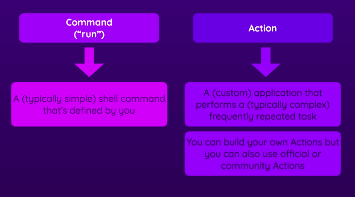

# GitHub Actions

a **workflow** automation service
automate **all kinds** of repository-related processes
CI/CD is no of many possible workflows

## workflows

when something happens IN or TO yout repository (Events)
automactic ACTIONS are executed in response

## resources

[starter-workflows](https://github.com/actions/starter-workflows)
[github-actions-course-resources](https://github.com/academind/github-actions-course-resources/tree/main/Code)

[events-that-trigger-workflows](https://docs.github.com/pt/actions/writing-workflows/choosing-when-your-workflow-runs/events-that-trigger-workflows)

## hello

```yaml
name: hello-actions
on: push

jobs:
  hello-action-job:
    runs-on: ubuntu-latest
    steps:
      - name: hello-step
        run: echo "Hello GitHubActions!"
```

## sintaxe básica:

```yaml
name: um-nome-opcional

on: event  # event

jobs:
  nome-do-job:
    runs-on: ubuntu-latest
    steps: 
      - name: step-name
        run: echo "a shell script or action"
      - name: step-name
        run: echo "are executed in order!"
```


## Action:
- a "custom command";
- an application that performs a task (more complex than a command)



exemplo de repo [/actions/checkout](https://github.com/actions/checkout)

existe um [marketplace](https://github.com/marketplace/actions/checkout)


```yaml
steps:
  # não roda no repo, tenho que baixar a branch:
  - name: Get my stuff
    # https://github.com/actions/checkout
    # https://github.com/marketplace/actions/checkout
    uses: actions/checkout@v4
    with: # para passar parâmetros para o use
      repository: "if-not-the-same" # nesse caso é opcional
```