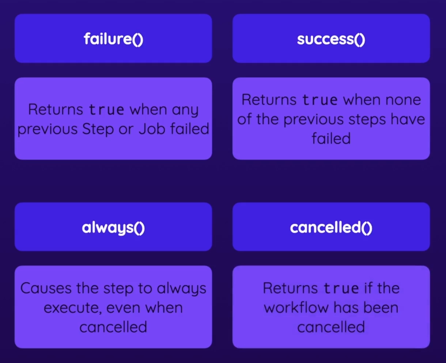

# conditions

Jobs e Steps podem ter condições


```yaml
jobs:
  conditions:
    if: true
    runs-on: ubuntu-latest
    steps:
      - name: if 0  # <- step condition
        if: 0
        run: echo "0!"
      - name: if 1
        if: 1
        run: echo "1!"
      - name: if true
        if: true
        run: echo "true!" && sleep 2
```

## conditional functions



```yaml
jobs:
  on-failure:
    needs: conditions  # sem isso nunca seria executado
    if: failure()
    runs-on: ubuntu-latest
    steps:
      - name: Deu ruim
        run: echo "Deu ruim!"
  on-success:
    needs: conditions
    if: success()
    runs-on: ubuntu-latest
    steps:
      - name: Foi tudo bem
        run: echo "Deu bão!"
  on-cancelled:
    needs: conditions
    if: cancelled()
    runs-on: ubuntu-latest
    steps:
      - name: Foi cancelado
        run: echo "Foi cancelado!"
  finally:
    needs: [on-failure, on-success, on-cancelled]
    if: always()
    runs-on: ubuntu-latest
    steps:
      - name: Sempre
        run: echo "Sempre!"
```
