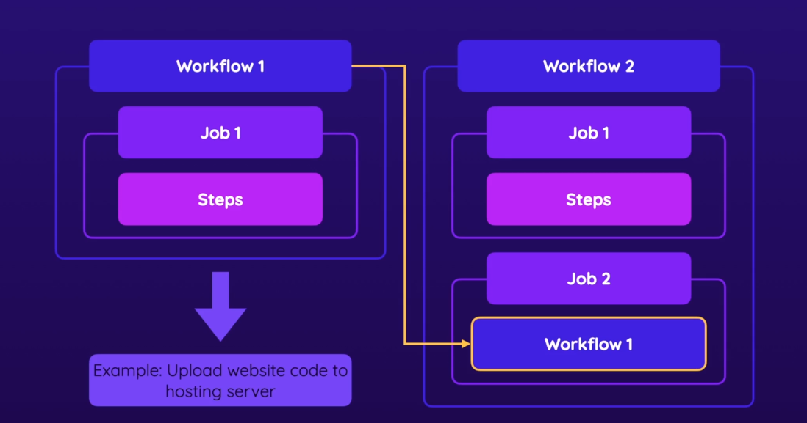

# Reusable Workflows



## inputs

```yaml
on:
  workflow_call:
    inputs:
      name:
        description: A name to be printed
        required: true
        type: string
      number:
        description: A number to be printed
        required: false
        default: 42
        type: number

jobs:
  reusable:
    runs-on: ubuntu-latest
    steps:
      - name: Print name
        run: echo ${{ inputs.name }}
      - name: Print number
        run: echo ${{ inputs.number }}
```
